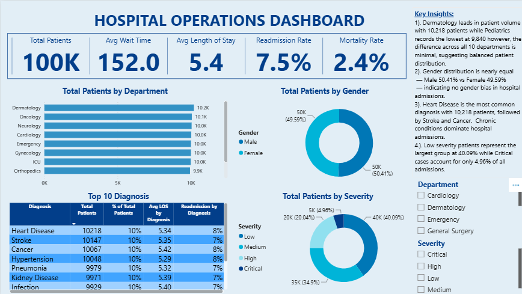
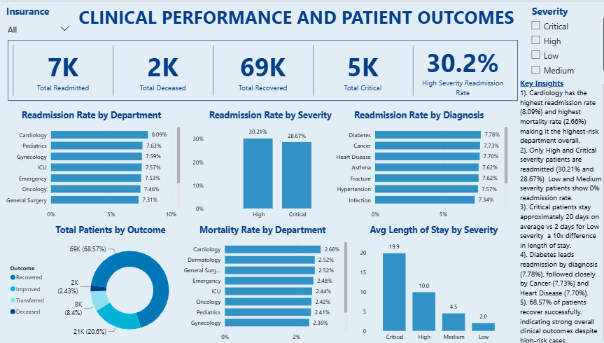

# Healthcare Data Analytics — Operations & Clinical Outcomes

## Overview
Healthcare institutions generate massive amounts of operational and clinical data daily. Without proper analysis, critical patterns such as which departments have the highest risk of patient readmission, which diagnoses drive the longest hospital stays, and where mortality risk is concentrated remain hidden. This leads to inefficient resource allocation and missed opportunities to improve patient outcomes.

This project performs an end-to-end analysis of a 100,000-patient hospital dataset to uncover operational inefficiencies and clinical performance gaps. Using MySQL for structured data exploration and Power BI for interactive dashboard development, the analysis answers key business and clinical questions that hospital administrators and clinical teams can act on.

This project combines data analytics skills with healthcare domain knowledge to generate insights relevant to hospital operations and patient outcomes.

## Problem Statement
Hospitals and healthcare administrators often struggle to identify which departments, diagnoses, and patient groups are driving poor clinical outcomes such as high readmission rates, prolonged hospital stays, and elevated mortality. Without data-driven insights, resource allocation decisions are made blindly, high-risk patients are not identified early enough, and systemic inefficiencies go unaddressed.

## Business Questions Answered
This analysis was designed to answer the following key operational and clinical questions:
1. Which departments carry the highest patient load and how evenly is patient distribution across departments?
2. What is the hospital's overall readmission rate and which departments are driving it?
3. Which patient severity levels are most associated with readmission and prolonged hospital stays?
4. Which diagnoses have the highest readmission rates and what does this mean for clinical management?
5. Which departments record the highest mortality rates and what patterns emerge?
6. Does a patient's insurance type influence their clinical outcome?
7. How does patient severity impact average length of stay and resource utilization?

## Tools & Technologies
1. Microsoft Excel - Initial data review and structure assessment
2.  MySQL - Database creation, data exploration, aggregations, and KPI calculations
3. Power BI -  Interactive dashboard development, DAX measures, and data visualization
   
## Dataset Information
- Source: Simulated hospital operations dataset
- Total Records: 100,000 patient records
- Departments Covered: Cardiology, Dermatology, Emergency, General Surgery, Gynecology, ICU, Neurology, Oncology, Orthopedic, Pediatrics
- Key Columns: Patient_ID, Age, Gender, Department, Diagnosis, Severity, Admission_Date, Discharge_Date, Length_of_Stay, Wait_Time_Minutes, Doctor_ID, Insurance, Treatment, Readmission, Outcome.

## Data Preparation & Cleaning
Before analysis, the dataset was reviewed and prepared to ensure accuracy and consistency.

The following steps were carried out:

1. Dataset Duplication
   Before making any changes, the original dataset was duplicated to preserve the raw data. All cleaning, preparation, and analysis steps were performed on the duplicate copy, ensuring the integrity of the original dataset was maintained throughout the project.
   
2. Structural Review
The dataset was first loaded into Microsoft Excel for an initial structural review. Column names, data types, and overall record count were verified. The dataset contained 100,000 rows and 15 columns with no missing values or duplicate records identified.

3. Data Type Validation
- Admission_Date and Discharge_Date columns were stored as text (VARCHAR) during MySQL import to avoid date format conflicts during the Table Data Import Wizard process
- Numeric columns such as Length_of_Stay, Wait_Time_Minutes, Age, and Readmission were confirmed as integer values
- Categorical columns such as Gender, Department, Severity, Insurance, Outcome, and Diagnosis were reviewed for inconsistent casing or spacing — none were found

4. Readmission Column Verification
The Readmission column was confirmed to contain binary values only (1 = Readmitted, 0 = Not Readmitted), making it suitable for direct aggregation in SQL without transformation

5. Database Import
The cleaned dataset was imported into MySQL Workbench using the Table Data Import Wizard into a database named healthcare_operations and a table named healthcare. Successful import was confirmed with:
SELECT COUNT(*)
FROM healthcare;
Result shows: 100,000 rows

## SQL Analysis
All data exploration and KPI calculations were performed in MySQL Workbench. A total of 19 queries were written covering database setup, patient volume analysis, readmission analysis, mortality analysis, length of stay, wait time, and clinical outcome exploration.

## Database & Table Setup
CREATE DATABASE healthcare_operations;

USE healthcare_operations;

CREATE TABLE healthcare (
    Patient_ID VARCHAR(20),
    Age INT,
    Gender VARCHAR(10),
    Department VARCHAR(50),
    Diagnosis VARCHAR(100),
    Severity VARCHAR(20),
    Admission_Date VARCHAR(30),
    Discharge_Date VARCHAR(30),
    Length_of_Stay INT,
    Wait_Time_Minutes INT,
    Doctor_ID VARCHAR(20),
    Insurance VARCHAR(50),
    Treatment VARCHAR(100),
    Readmission VARCHAR(10),
    Outcome VARCHAR(50)
    );
    
   -- How many patients are in the dataset?
SELECT COUNT(*) AS Total_Patients 
FROM healthcare;

-- How many unique departments?
SELECT COUNT(DISTINCT Department) AS Total_Departments 
FROM healthcare;

-- What departments exist?
SELECT DISTINCT Department 
FROM healthcare;

-- Gender distribution
SELECT Gender, COUNT(*) AS Total
FROM healthcare 
GROUP BY Gender;

-- Average age of patients
SELECT ROUND(AVG(Age), 1) AS Average_Age 
FROM healthcare;

-- Patient distribution by department
SELECT Department, COUNT(*) AS Total_Patients
FROM healthcare
GROUP BY Department
ORDER BY Total_Patients DESC;

-- Severity distribution
SELECT Severity, COUNT(*) AS Total
FROM healthcare
GROUP BY Severity
ORDER BY Total DESC;

-- Readmission rate
SELECT Readmission, COUNT(*) AS Total
FROM healthcare
GROUP BY Readmission;

-- Outcome distribution
SELECT Outcome, COUNT(*) AS Total
FROM healthcare
GROUP BY Outcome
ORDER BY Total DESC;
    
-- Average wait time by department
SELECT Department, 
       ROUND(AVG(Wait_Time_Minutes), 1) AS Avg_Wait_Time
FROM healthcare
GROUP BY Department
ORDER BY Avg_Wait_Time DESC;

-- Average length of stay by severity
SELECT Severity, 
       ROUND(AVG(Length_of_Stay), 1) AS Avg_Length_of_Stay
FROM healthcare
GROUP BY Severity
ORDER BY Avg_Length_of_Stay DESC;

-- Readmission rate by department
SELECT Department,
       COUNT(*) AS Total_Patients,
       SUM(Readmission) AS Readmitted,
       ROUND(SUM(Readmission) / COUNT(*) * 100, 1) AS Readmission_Rate_Percent
FROM healthcare
GROUP BY Department
ORDER BY Readmission_Rate_Percent DESC;

-- Mortality rate by department
SELECT Department,
       COUNT(*) AS Total_Patients,
       SUM(CASE WHEN Outcome = 'Deceased' THEN 1 ELSE 0 END) AS Deaths,
       ROUND(SUM(CASE WHEN Outcome = 'Deceased' THEN 1 ELSE 0 END) / COUNT(*) * 100, 1) AS Mortality_Rate
FROM healthcare
GROUP BY Department
ORDER BY Mortality_Rate DESC;

-- Readmission rate by severity
SELECT Severity,
       COUNT(*) AS Total_Patients,
       SUM(Readmission) AS Readmitted,
       ROUND(SUM(Readmission) / COUNT(*) * 100, 1) AS Readmission_Rate
FROM healthcare
GROUP BY Severity
ORDER BY Readmission_Rate DESC;

-- Most common diagnosis
SELECT Diagnosis,
       COUNT(*) AS Total_Patients
FROM healthcare
GROUP BY Diagnosis
ORDER BY Total_Patients DESC
LIMIT 10;

-- Average wait time by severity
SELECT Severity,
       ROUND(AVG(Wait_Time_Minutes), 1) AS Avg_Wait_Time
FROM healthcare
GROUP BY Severity
ORDER BY Avg_Wait_Time DESC;

-- Outcome by insurance type
SELECT Insurance,
       COUNT(*) AS Total_Patients,
       SUM(CASE WHEN Outcome = 'Recovered' THEN 1 ELSE 0 END) AS Recovered,
       ROUND(SUM(CASE WHEN Outcome = 'Recovered' THEN 1 ELSE 0 END) / COUNT(*) * 100, 1) AS Recovery_Rate
FROM healthcare
GROUP BY Insurance
ORDER BY Recovery_Rate DESC;

-- Gender vs readmission
SELECT Gender,
       COUNT(*) AS Total_Patients,
       SUM(Readmission) AS Readmitted,
       ROUND(SUM(Readmission) / COUNT(*) * 100, 1) AS Readmission_Rate
FROM healthcare
GROUP BY Gender;

-- Top 5 doctors by patient volume
SELECT Doctor_ID,
       COUNT(*) AS Total_Patients,
       ROUND(AVG(Length_of_Stay), 1) AS Avg_Length_of_Stay,
       ROUND(AVG(Wait_Time_Minutes), 1) AS Avg_Wait_Time
FROM healthcare
GROUP BY Doctor_ID
ORDER BY Total_Patients DESC
LIMIT 5;

## Key Findings
Hospital Overview
- The hospital recorded a total of **100,000 patients** across **10 departments** with an average patient age of **47.4 years**
- Patient distribution across departments is relatively balanced, ranging from 9,840 patients in Pediatrics to 10,218 in Dermatology, with no substantial differences in patient volume across departments.
- Gender split is nearly balanced, with **Male 50.41%  and Female 49.59%** of patients
- **Heart Disease** is the most common diagnosis with 10,218 patients, followed by Stroke (10,147) and Cancer (10,067), confirming that chronic conditions dominate hospital admissions
- Severity distribution: Low 40.09%, Medium 34.90%, High 20.04%, Critical 4.96%

Readmission Analysis
- The overall hospital readmission rate is **7.5%** — meaning 7,477 out of 100,000 patients were readmitted
- **Cardiology** records the highest readmission rate at **8.09%**, followed by Pediatrics (7.63%) and Gynecology (7.59%)
- Readmission was concentrated among High and Critical severity patients, with readmission rates of 30.21% and 28.67%, respectively, while Low and Medium severity patients recorded 0% readmission. This suggests a strong association between patient severity and readmission in this dataset.
- **Diabetes leads readmission by diagnosis** at 7.78%, followed by Cancer (7.73%) and Heart Disease (7.70%)

Mortality Analysis
- The overall hospital mortality rate is **2.4%** — meaning 2,433 patients out of 100,000 did not survive
- **Cardiology** also records the highest mortality rate at **2.66%**, making it the highest-risk department across both readmission and mortality metrics
- Emergency (2.52%), Dermatology (2.52%), and General Surgery (2.52%) follow closely behind

Operational Performance
- Average hospital wait time is **152.0 minutes** and remains remarkably consistent across all departments ranging only from 150.0 (Dermatology) to 153.0 (ICU)
- The consistency of wait times across departments suggests that the underlying factors influencing patient waiting time may be hospital-wide rather than isolated to a single department. Further process-level investigation would be required to identify the specific causes.
- Average length of stay increases dramatically with severity — Critical patients average **19.9 days** compared to just **2.0 days** for Low severity patients, approxiamately 10x difference reflecting the resource intensity of critical care

Clinical Outcomes & Insurance
- **68.57% of patients recovered successfully**, with a further 20.6% showing improvement
- Recovery rates were broadly consistent across insurance types, ranging from 68.3% to 68.8%, suggesting little observable difference in recovery rates by insurance category within this dataset.

  ## Dashboard Preview

## Dashboard Overview
The Power BI dashboard consists of two interactive pages, each targeting a distinct analytical perspective.

Page 1 — Hospital Operation Dashboard
This page provides a high-level overview of hospital operations and patient distribution.

**KPI Cards:**
- Total Patients: 100K
- Average Wait Time: 152.0 minutes
- Average Length of Stay: 5.4 days
- Readmission Rate: 7.5%
- Mortality Rate: 2.4%

**Visuals:**
- Total Patients by Department (bar chart)
- Total Patients by Gender (donut chart)
- Total Patients by Severity (donut chart)
- Top 10 Diagnosis table showing Total Patients, % of Total, Average Length of Stay, and Readmission Rate by Diagnosis

**Filters:** 
- Department slicer
-  Severity slicer

Page 2 — Clinical Performance & Patient Outcomes
This page dives deeper into clinical risk, readmission patterns, and patient outcomes.

**KPI Cards:**
- Total Readmitted: 7K
- Total Deceased: 2K
- Total Recovered: 69K
- Total Critical: 5K
- High Risk Readmission Rate: 30.2%

**Visuals:**
- Readmission Rate by Department (bar chart)
- Readmission Rate by Severity (column chart)
- Readmission Rate by Diagnosis (bar chart)
- Mortality Rate by Department (bar chart)
- Total Patients by Outcome (donut chart)
- Average Length of Stay by Severity (column chart)

**Filters:** 
- Insurance slicer
- Severity slicer

## DAX Measures
The following DAX measures were created in Power BI to calculate key clinical performance metrics:

-- Overall readmission rate
Readmission Rate = 
DIVIDE(
    CALCULATE(COUNTROWS('healthcare_operations healthcare'), 'healthcare_operations healthcare'[Readmission] = 1),
    COUNTROWS('healthcare_operations healthcare'))

-- Overall mortality rate
Mortality Rate = 
DIVIDE(
    CALCULATE(COUNTROWS('healthcare_operations healthcare'), 'healthcare_operations healthcare'[Outcome] = "Deceased"),
    COUNTROWS('healthcare_operations healthcare'))

-- Total readmitted patients
Total Readmitted = 
CALCULATE(COUNTROWS('healthcare_operations healthcare'), 'healthcare_operations healthcare'[Readmission] = 1)

-- Total deceased patients
Total Deceased = 
CALCULATE(COUNTROWS('healthcare_operations healthcare'), 'healthcare_operations healthcare'[Outcome] = "Deceased")

-- Total recovered patients
Total Recovered = 
CALCULATE(COUNTROWS('healthcare_operations healthcare'), 'healthcare_operations healthcare'[Outcome] = "Recovered")

-- Total critical patients
Total Critical = 
CALCULATE(COUNTROWS('healthcare_operations healthcare'), 'healthcare_operations healthcare'[Severity] = "Critical")

-- High severity readmission rate
High severity Readmission rate = 
CALCULATE([Readmission Rate], 'healthcare_operations healthcare'[Severity] = "High")

## Project Structure
healthcare_operations_clinical_outcomes
README.md  (Project documentation)
healthcare_analysis.sql (All SQL queries)
Hospital_Operation_Dashboard.Pdf
page1_hospital Operations Dashboard.png
page2_clinical Performance & Patient Outcomes.png

## Recommendations
Based on the findings from this analysis, the following recommendations are proposed for hospital management:

1. **Prioritize Cardiology Department** — Cardiology recorded the highest readmission rate (8.09%) and highest mortality rate (2.66%). Hospital management should investigate staffing levels, treatment protocols, and post-discharge follow-up processes within this department
2. **Implement High and Critical Severity Monitoring Programs** — Since only High and Critical severity patients are readmitted, targeted post-discharge care programs and early warning systems should be established specifically for these patient groups
3. **Address Systemic Wait Time Inefficiencies** — The consistency of wait times across all departments (~152 minutes) suggests a hospital-wide bottleneck rather than department-specific issues. Process improvements at the admission and triage level should be investigated
4. **Focus Chronic Disease Management on Diabetes, Cancer and Heart Disease** — These three diagnoses drive the highest readmission rates and should be prioritized in chronic disease management and patient education programs
5. **Monitor Outcome Patterns Across Insurance Types** — Recovery rates were broadly consistent across insurance categories in this dataset. Hospital management should continue monitoring outcome patterns across insurance groups to ensure consistent standards of care and identify any emerging disparities.

## Author
Adesoji Justina Ayomide
Radiography Student | Healthcare Data Analyst
| Nigeria |
 www.linkedin.com/in/justina-ayomide

